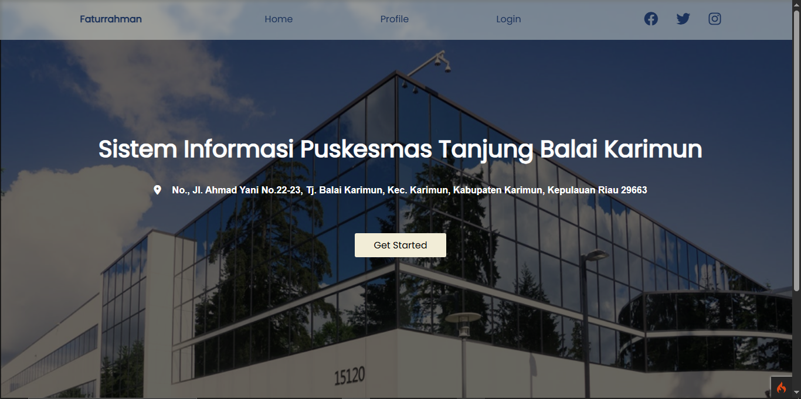
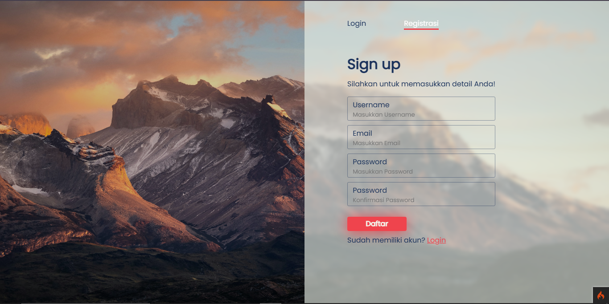
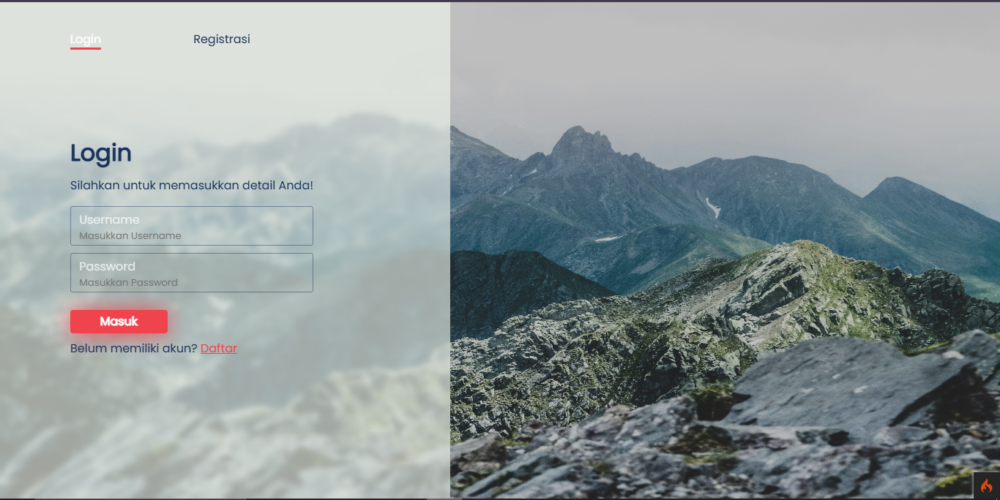
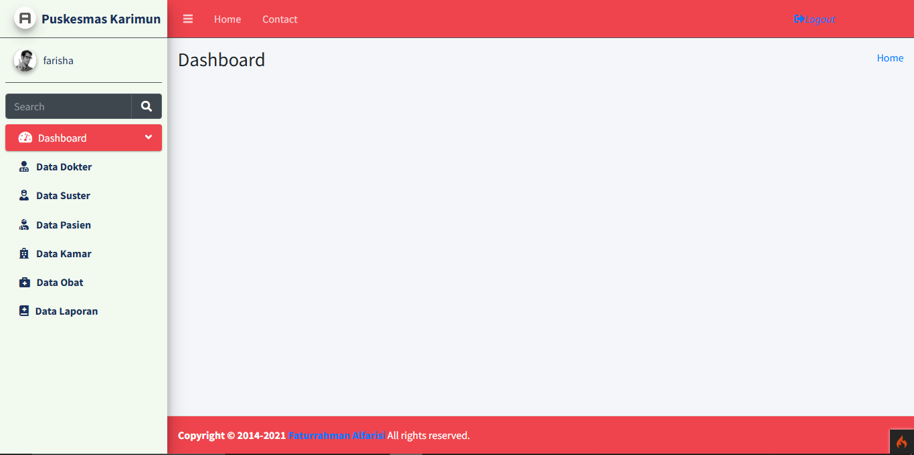
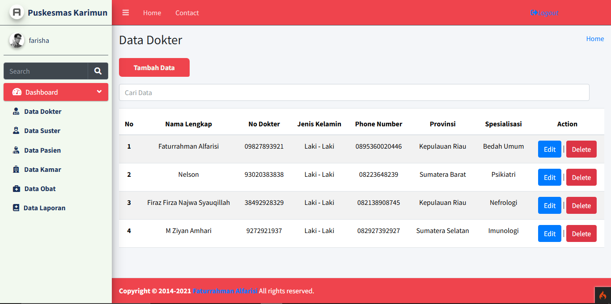
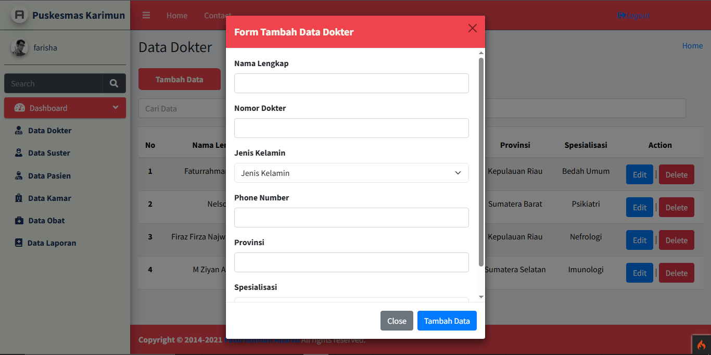
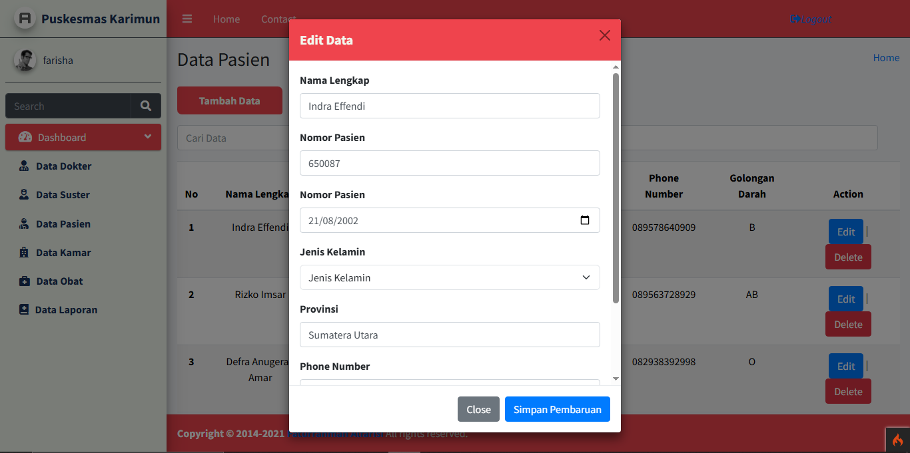
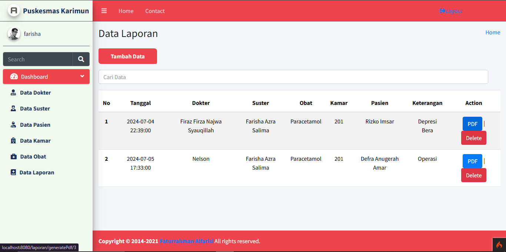
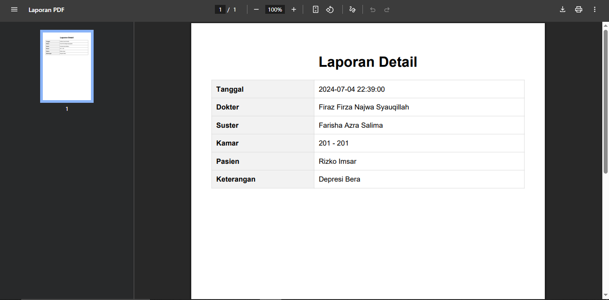

# Sistem Informasi Rumah Sakit

Project sederhana ini merupakan project sederhana untuk memenuhi tugas dengan mata kuliah web programming

Web ini dibangun dengan menggunakan CodeIgniter4 dengan fitur CRUD sederhana (Create, Read, Update, Delete) data dan terdapat fitur cetak PDF menggunakan library DOMPdf.

Jika tertarik dengan project atau ingin melihat project ini, silahkan mengikuti panduan di bawah :
1. Silahkan melakukan git cloning atau forking pada repository ini
2. Buka folder project, lalu cara file sql dan melakukan import pada file tersebut ke database
3. Buka terminal dan jalankan perintah "php spark serve" untuk menjalankan local development server

Noted: Jika terdapat folder bernama "docs" pada struktur folder project silahkan dihapus jika tidak digunakan!

Enjoyyy :)

## Preview Peoject :

Halaman utama saat memasuki website

Halaman untuk melakukan registrasi, jika user belum memiliki akun pada sistem

Halaman login untuk user jika ingin mengakses sistem

Halaman Dashboard admin

Halaman yang bertujuan untuk menampilkan data-data seperti data dokter, data suster, data obat dan lain-lain

Halaman untuk menambahkan data

Halaman untuk mengedit/mengupdate/mengubah data yang telah ada sebelumnya

Halaman laporan admin jika ingin mencetak laporan ke dalam pdf

Tampilan pdf saat tombol PDF ditekan pada halaman sebelumnya, fitur ini dibuat menggunakan library DOMPdf.

Thankk UU!
